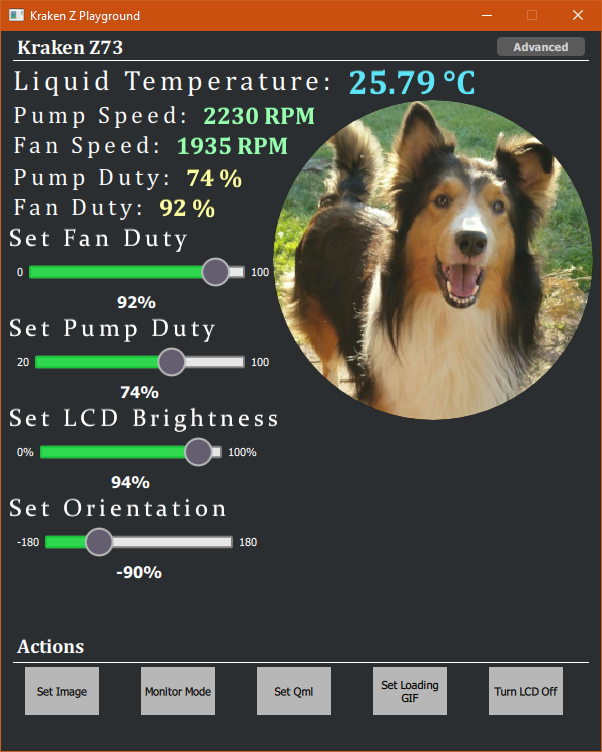

# Kraken Z Playground
Fun interaction and play with NZXT Kraken Z AIOs and the Qml language. The application connects and communicates with the Kraken Z series AIO through USB. 
Through the application the user can change pump speeds, fan speeds and brightness. Orientation for the Kraken Z series is handled in software. 

# Discussion for App development and bugs
Get help and discuss the application on the *Device Chain* discord. Please use Channel [kraken-z-playground](https://discord.gg/zTrAYseK)

# Cool Community projects
 - So empty.... 

 join the discord discussion and share your project or make a pull request with a link and one sentence description of project.

# Running QML 
It is possible to run Qml on the kraken device using "Set Qml button". The Qml file chosen will load as the "root" Qml object and provides access to a KrakenZDriver. This object will be the live connection to the KrakenDevice. Using methods and properties, your Qml code can interact with the display in real time; including the ability to show animations, images, and even play sounds. The project contains 3 Qml examples, A Clock, a Monitoring app, and Krakify.
## Example - Krakify Qml
Plays a single song [Fly by Fransis Derelle,Parker Polhil](https://ncs.io/fly)

And uses the Qml Audio item to play and communicate position and duration information.

## Example - Monitor Qml
A mixture of gifs (frame speed controlled by pump and fan rpm) and live content

## Example - Clock Qml
A less fancy version of the [Qt Qml Clock Demo](https://doc.qt.io/qt-5/qtdoc-demos-clocks-example.html)

## Clone with git (cli)
`git clone https://github.com/ProtozeFOSS/KrakenZPlayground`

`cd KrakenZPlayground`

`git submodule init --recursive`

## Building from source
Follow the guid based on your platform
### Windows

### 1. Download and Install Tools
*  [Download Build Tools for Visual Studio](https://visualstudio.microsoft.com/downloads/) and run it

 

  * Select and Install C++ development environment on the installer (windows SDK, Debugger, etc)
  * Install Qt5 (latest) for MSVC - choose your native architecture ( and Qt Creator )
### 2. Open KrakenZPlayground.pro (project) in `Qt Creator` , configure the project to use the `MSVC kit installed earlier`
### 3. Build and run the project `(make sure NZXT CAM is closed)`

### Linux
* Use your package manager (or I recommend the Qt.io online installer if it runs on your distribution).
* Qt requires a lot of dependencies, make sure they are all installed. (Like if you have errors, this is where they will be)
* Qt Usb uses the libusb1-dev (developer packages) package so install that
* Qt Creator is not required but you will need to be able to use qmake from the commandline to build if not.
  * Install UDEV rules for the Kraken Device if you have not

    `# NZXT Kraken Z (Z53, Z63 or Z73)`

    `SUBSYSTEMS=="usb", ATTRS{idVendor}=="1e71", ATTRS{idProduct}=="3008", TAG+="uaccess"`
  * Build and run the application.  

# *License*
[Mit License](/LICENSE) :neckbeard:

# Project Dependencies
Like most projects, this one has dependencies
* [Qt5](https://qt.io) (core,gui,quick, multimedia)
* [QtUsb](https://github.com/fpoussin/QtUsb) - I'm using a [forked version](https://github.com/ProtozeFOSS/QtUsb) at the moment with some additions of my own
* [libusb](https://github.com/jdkvision/libusb) (also required by QtUsb) to connect to the Kraken Device. I have [forked](https://github.com/Tpimp/libusb) and made changes on the windows side, hopefully will be mainline soon
* The Krakify example uses [arunpkqt's Radial Bar Demo](https://github.com/arunpkqt/RadialBarDemo) for the circular progress bar