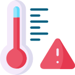

## Image References

Not found icon - <a href="https://www.flaticon.com/free-icons/page-not-found" title="page not found icons">Page not found icons created by Freepik - Flaticon</a>

Icon by <a href='https://iconpacks.net/?utm_source=link-attribution&utm_content=4291'>Iconpacks</a>

I used the trash can found below to build the animation

https://icon-library.com/icon/small-trash-can-icon-5.html.html>Small Trash Can Icon # 240409

<a href="https://www.flaticon.com/free-icons/high-temperature" title="high temperature icons">High temperature icons created by Freepik - Flaticon</a>

<a href="https://www.flaticon.com/free-icons/electric-current" title="electric current icons">Electric current icons created by Freepik - Flaticon</a>

<a href="https://www.flaticon.com/free-icons/fan" title="fan icons">Fan icons created by Freepik - Flaticon</a>

<a href="https://www.flaticon.com/free-icons/performance" title="performance icons">Performance icons created by juicy_fish - Flaticon</a>

<a href="https://www.flaticon.com/free-icons/cpu" title="cpu icons">Cpu icons created by Freepik - Flaticon</a>

<a href="https://www.flaticon.com/free-icons/gpu" title="gpu icons">Gpu icons created by Freepik - Flaticon</a>

<a href="https://www.flaticon.com/free-icons/ram" title="ram icons">Ram icons created by Slidicon - Flaticon</a>

"Frequency" Created by Christopher Dean 8/8/22

"Factor" Created by Christopher Dean 8/8/22